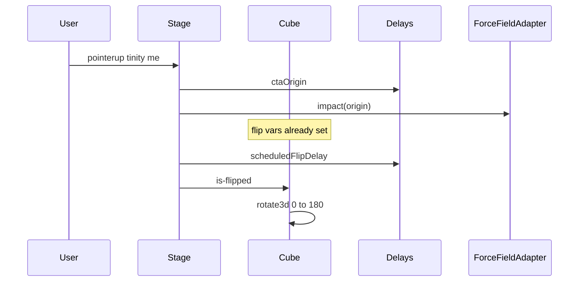

# Design: landing-epicentric-flip

## Technical Approach

Faces A + rotation R1. Numbered cubes idle as occupancy glass (transparent fill, shared grout inset, no `backdrop-filter`). On `tinity me`, only `role === "number"` cubes flip 180° via per-tile `rotate3d` from `flipAxis(tile, ctaOrigin)`. `flipDelay` / `startFlips` stay. Occupancy, CTA, lattice, and `ForceField.tsx` stay frozen. Brand: `landing/DESIGN.md` (hairline, no glassmorphism, `#1fdb12` is not body copy).

## Architecture Decisions

| Decision | Options | Tradeoff | Choice |
|----------|---------|----------|--------|
| Faces | A glass+hairline; B gray plates; C WAAPI/glyph/WebGL | B is rejected idle gray. C1 splits motion; C2 is not a cube flip; C3 second context | **A** |
| Rotation | R1 CSS vars; R2 WAAPI; R3 GSAP/three | R2 rewrites `is-flipped`; R3 new deps | **R1** |
| Axis | CW `{x: dy/len, y: -dx/len}`; CCW invert | CSS Y-down vs `rotate3d` may need one invert | **CW**; invert once in apply if inner edge advances — no WAAPI |
| 90° edge | #747 plates; rotor+thin edge; keyed spine | Plates caused idle gray | **Keep #747 rotor/timing; drop plates** |
| Glyph | `--text`; `#1fdb12` | Accent is not body copy | **`--text`**, no plate |
| Cube memo | Ignore axis; pass `--flip-x/--flip-y` | Omitting freezes axis after resize | **Inline unitless vars; memo-compare them** |

### Idle glass vs #747 keepers

**Keep:** `.cube-inner` rotor, `backface-visibility: hidden`, `720ms linear`, `translateZ` thickness, reduced-motion instant class.

**Drop:** numbered `inset: 0`, front `rgba(17,17,17,0.92)`, spine `12px` `#0c0c0c`, back `rgba(8,8,8,0.96)`.

**Idle glass:** occupancy inset `calc(0.03 * var(--cell-css))` and `background: transparent`. Spine `1–2px` `var(--hairline)`. No `backdrop-filter`. If apply-phase 90° vanishes, add 1px `--hairline` on rotating faces — still no `--surface` fill.

## Data Flow

```
onCta (idle)
  ├─ ctaOrigin(tiles)
  ├─ field.impact(origin)     [adapter only; do not edit ForceField.tsx]
  └─ startFlips(origin)       [flipDelay stagger unchanged]
        timeout → flippedIds.add(id)
              .is-flipped → rotate3d(var(--flip-x), var(--flip-y), 0, 180deg)

Idle numbered Cube
  flipAxis(tile, origin) → inline --flip-x --flip-y (unitless)
  .cube-inner → rotate3d(..., 0deg)
```



Occupancy stays one flat `.cube-face`. CTA stays a button. Neither gets flip vars nor `.is-flipped`.

## File Changes

| File | Action | Description |
|------|--------|-------------|
| `landing/src/experience/delays.ts` | Modify | Add `flipAxis` beside `flipDelay` |
| `landing/src/experience/delays.test.ts` | Modify | Compass + coincidence |
| `landing/src/experience/Stage.tsx` | Modify | `--flip-x`/`--flip-y` on number Cubes; memo includes them |
| `landing/src/experience/Stage.test.tsx` | Modify | Idle two-face; opposite-side signs; occupancy/CTA never flipped |
| `landing/src/styles/tokens.css` | Modify | Glass idle; 1–2px hairline spine; `rotate3d` vars |

Do not edit `ForceField.tsx`, `tiles.ts`, `machine.ts`, adapters, or prior OpenSpec folders. jsdom does not load `tokens.css` — Stage tests assert inline vars and structure, not computed plate colors.

## Interfaces / Contracts

```ts
export function flipAxis(tile: Tile, origin: { x: number; y: number }) {
  const dx = tile.x + tile.size / 2 - origin.x;
  const dy = tile.y + tile.size / 2 - origin.y;
  const len = Math.hypot(dx, dy);
  if (len === 0) return { x: 0, y: -1 };
  return { x: dy / len, y: -dx / len }; // CW perp of (dx, dy)
}
```

East `(+1,0)` → `{0,-1}`; West `(-1,0)` → `{0,1}`; South `(0,+1)` → `{1,0}`; North `(0,-1)` → `{-1,0}`; coinciding → `{0,-1}`, finite, not `NaN`.

```css
.cube-inner { transform: rotate3d(var(--flip-x, 0), var(--flip-y, -1), 0, 0deg); }
.cube.is-flipped .cube-inner { transform: rotate3d(var(--flip-x, 0), var(--flip-y, -1), 0, 180deg); }
```

Vars are unitless. Defaults match coincidence. Stage merges them into numbered `cubeBox` only.

## Testing Strategy

| Layer | What | Approach |
|-------|------|----------|
| Unit | `flipAxis` compass, coincidence, finite | Vitest in `delays.test.ts` |
| Stage | Opposite-side signs; occupancy/CTA unflipped; idle two-face | Extend `Stage.test.tsx` |
| Browser | Inner-edge recede; 90° hairline | Apply-phase check |
| Threat | N/A | No routing/shell/process boundary |

### TDD order (`pnpm --dir landing test`)

1. RED `flipAxis` tests. 2. GREEN `flipAxis`. 3. RED Stage var/sign/never-flip tests. 4. GREEN Stage vars + memo. 5. Tokens last. Ignore Engram `sdd-init` `strict_tdd: false`.

## Threat Matrix

N/A — no routing, shell, subprocess, VCS/PR automation, executable-file classification, or process-integration boundary.

## Migration / Rollout

No migration. Authored delta well under 400 lines; `ask-on-risk` should not need a chain.

**Rollback:** revert the five files above. Fusion layout, roles, `ctaOrigin`, and Force Field stay.

## Open Questions

- [ ] Apply-phase: if the inner edge advances, invert `flipAxis` and the compass once. No WAAPI.
- [ ] Apply-phase: if 90° vanishes, add 1px `--hairline` on rotating faces. No gray plates.
