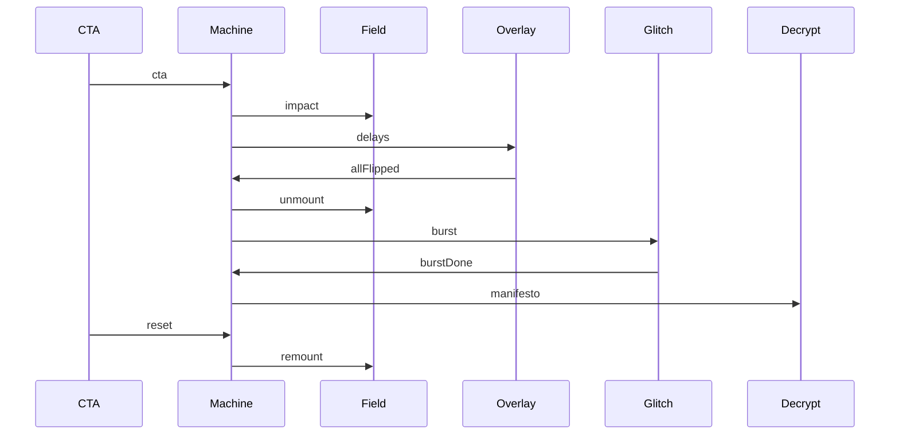

# Design: Tinity Landing

Vite + React 19 + TS in `landing/` (`base: '/tinity/'`). Approach A: copied Canvas UI, 17 DOM tiles, one WebGL context. Tokens from `landing/DESIGN.md` only. Specs were absent; follows the proposal.

## Technical Approach

`pnpm --dir landing`. Copy `@canvas-ui/force-field-react`, `glitch-react`, `decrypt-reveal-react` to `landing/src/components/canvasui/` plus `rect-cache.ts` (`../rect-cache`). Adapters wrap exported `createForceField` / `createGlitch` / `createDecryptReveal` with `forwardRef` for `impact`, `burst`, `onReady`. No shader edits. Idle = Force Field. CTA `tinity me` owns the machine.

## Architecture Decisions

| Decision | Options | Tradeoff | Choice |
|----------|---------|----------|--------|
| Stack | A Vite+React 19 / B vanilla / C custom GL | B drops React+Vitest; C rewrites shaders | **A** |
| Ingest | shadcn theme init / three files + rect-cache | Init pulls Base UI/MUI | **Copy registry only** |
| Engine | Patch vendor React / wrap `create*` | Hidden refs; shaders co-located | **Adapters**; vendor React unused |
| Tiles | Shader glyphs / DOM | `onHit` is origin-only | **DOM**, `square`, `cellScale: 9` |
| Flip | Per-cell callback / JS delay | No per-cell API | **dist/(rippleSpeed×minSide)**, speed `1.6` |
| WebGL | Three mounted / one slot | Mobile context limit | **field→unmount→burst→decrypt** |
| Glitch | `interval: 3` / raised | Auto-burst | **`interval: 1e6`**, one `burst()` |
| Decrypt | `#4ade80` / brand | Wrong green | **`#1fdb12` / `#050505`** |
| Trigger | Field click / CTA | Proposal is CTA toggle | **CTA + `impact`**; `clickRipples: false` |
| 17 cells | Fixed index / nearest center | Resize | **Nearest center**, labels `01`–`17` row-major |
| Fonts | System / Geist | DESIGN.md | **fontsource Geist Sans+Mono** |
| Delivery | One PR / two slices | ~3068 vendor vs 400 | **V** vendor+scaffold; **E** experience. `size:exception` OK for `pnpm --dir landing dev` |

## Data Flow

```
loader --ready--> idle --cta--> revealed --allFlipped--> bursting --burstDone--> decrypted
                    ^              |                         |
                    +------cta-----+------------cta----------+
reduced-motion: skip bursting; delays=0.
```



Origin = CTA pointer (stage CSS px). Overlay `pointer-events: none`. Void `--bg #050505`.

## File Changes

| File | Action | Description |
|------|--------|-------------|
| `landing/DESIGN.md` | Keep | Tokens. Do not edit. |
| `landing/package.json`, `vite.config.ts`, `index.html`, `tsconfig*.json`, `src/main.tsx`, `src/App.tsx` | Create | React 19/Vite/Vitest; `base: '/tinity/'` |
| `landing/src/styles/tokens.css` | Create | DESIGN.md dark `:root`; no second accent |
| `landing/src/components/canvasui/*`, `rect-cache.ts` | Create | Registry bytes; keep `*Vanilla.ts` if CLI splits |
| `landing/src/experience/{machine,tiles,delays,Stage,adapters/*,*.test.ts}` | Create | Machine, overlay, one WebGL slot, CTA, tests |
| `openspec/config.yaml` | Modify later | `strict_tdd: true`; `test_command: pnpm --dir landing test` |

## Interfaces / Contracts

```ts
type Phase = "loader" | "idle" | "revealed" | "bursting" | "decrypted";
type Event = { type: "ready" | "cta" | "allFlipped" | "burstDone" };
function reduce(phase: Phase, event: Event, reducedMotion: boolean): Phase;
type Tile = { id: string; col: number; row: number; x: number; y: number; size: number };
function layoutTiles(w: number, h: number): Tile[]; // cellSize=min(w,h)/9
function flipDelay(tile: Tile, origin: {x:number;y:number}, speed: number, minSide: number): number;
type Slot = "field" | "glitch" | "decrypt" | "none"; // ≤1 live effect
```

Field: `gridReveal: "always"`, `color: [0.122, 0.859, 0.071]`, `rippleWidth: 0.018`, `rippleBlend: 0.25`. CTA: fill `#1fdb12`, text `#061008`, radius 6px, no shadow. Tiles: hairline + `--surface`, Geist Mono. Decrypt children = proposal manifesto. Loader `onReady(instance | null)`; GL fail still → `idle`.

## Testing Strategy

| Layer | What | Approach |
|-------|------|----------|
| Unit | `reduce`, `layoutTiles`, `flipDelay` (incl. reduced motion) | Vitest, no WebGL |
| Integration / E2E | none v1 | Manual `pnpm --dir landing dev` |

## Threat Matrix

N/A — no routing, shell, subprocess, VCS/PR, executable-file, or process-integration boundary. `base` is an asset prefix.

## Migration / Rollout

No migration. Slice V: scaffold+vendor+idle field (chained or `size:exception`). Slice E: machine/overlay/swap/tests (authored ≤400). No portfolio mount. Rollback: delete `landing/` except `DESIGN.md`.

## Open Questions

- [x] 17 squares — nearest center, row-major `01`–`17`.
- [x] Reduced motion — instant flip+manifesto; skip wave/glitch.
- [ ] Specs absent; tasks must not invent a second accent or stack.
